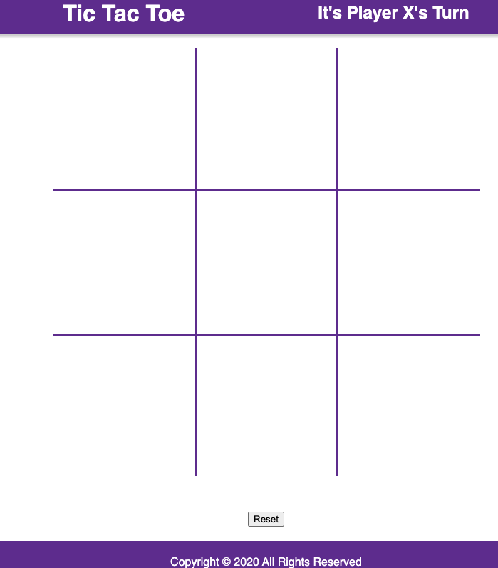
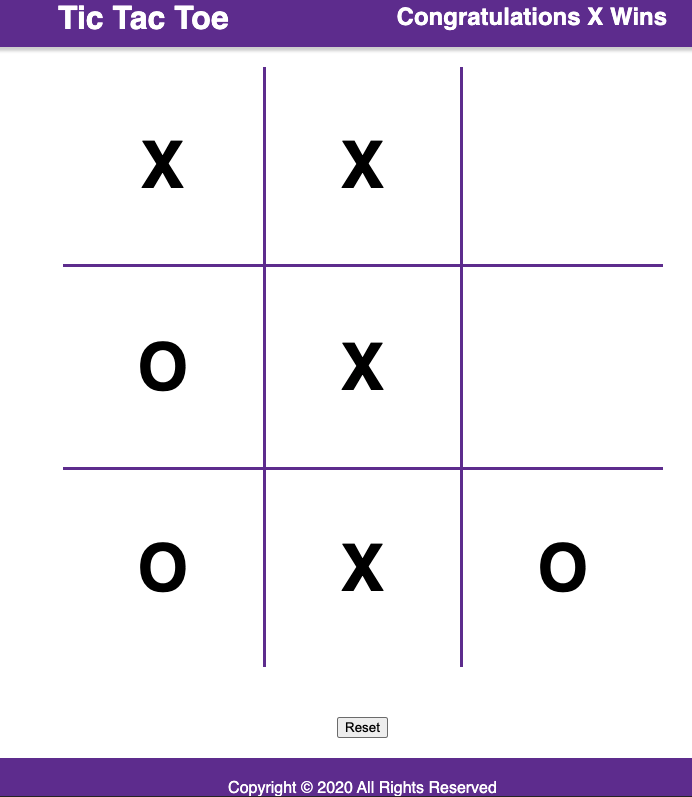
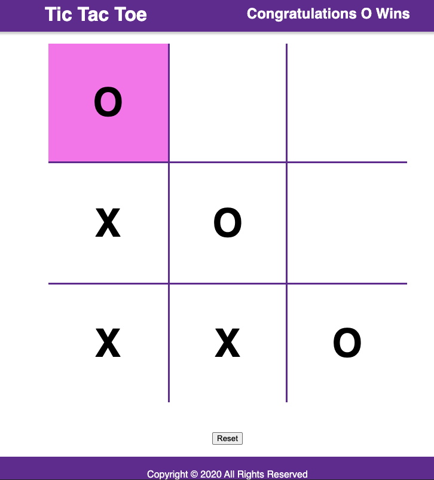
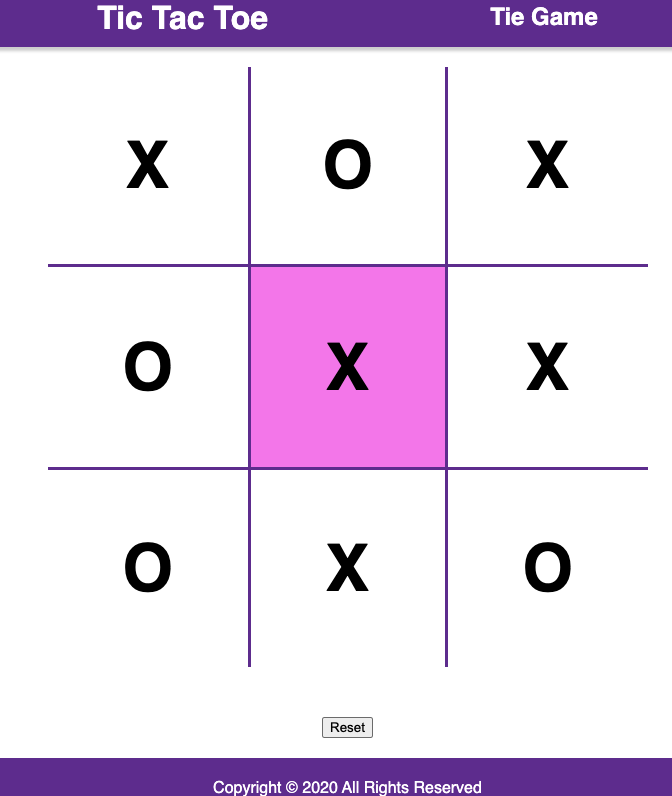

# Tic Tac Toe
---

A simple implementation of the classic tic tac toe game in the browser

## Check it out @ [TicTacToe]() 🌐

Features:
- Alternate between players
- Win/Tie Detection
- User friendly website manipulation

---

## Technologies 💻
-  HTML5
-  CSS3
-  JavaScript
-  JQuery

---

## Screenshots 📸

### Landing Page

---

### X Win Page

---

### O Win Page

---

### Tie Page

---
